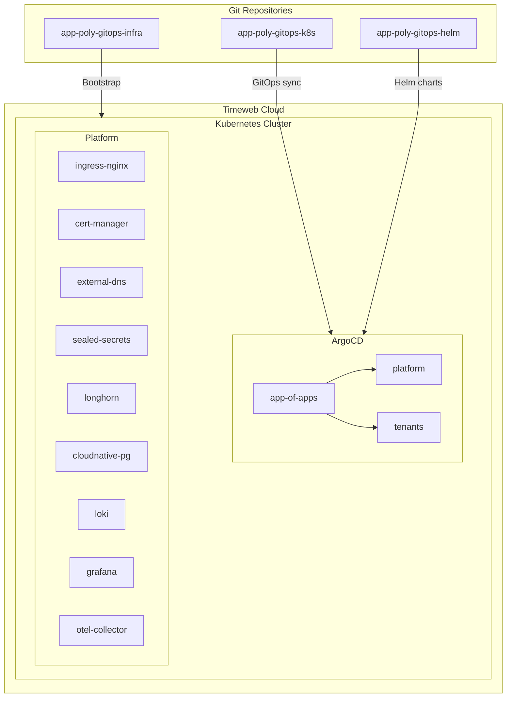

# app-poly-gitops-infra

Infrastructure provisioning and ArgoCD bootstrap for GitOps platform.

## Prerequisites

- [Terraform](https://terraform.io) >= 0.13
- [Taskfile](https://taskfile.dev)
- [kubectl](https://kubernetes.io/docs/tasks/tools/)
- [Helm](https://helm.sh)
- [twc CLI](https://timeweb.cloud/docs/cli) (Timeweb Cloud CLI)
- Timeweb Cloud account with API token

## Quick Start

```bash
# 1. Copy .env.example to .env and fill in your credentials
cp .env.example .env
# Edit .env with your tokens

# 2. Full setup (Taskfile will automatically load .env)
task up
```

Alternative (manual export):
```bash
export TF_VAR_timeweb_token="your-timeweb-token"
export AWS_ACCESS_KEY_ID="s3-access-key"
export AWS_SECRET_ACCESS_KEY="s3-secret-key"
task up
```

## Available Tasks

| Task | Description |
|------|-------------|
| `task init` | Initialize Terraform and create k8s cluster |
| `task plan` | Show Terraform plan |
| `task kubeconfig` | Get kubeconfig from Timeweb |
| `task bootstrap` | Install ArgoCD via Helm |
| `task app-of-apps` | Deploy root Application |
| `task argocd-password` | Get ArgoCD admin password |
| `task argocd-port-forward` | Port-forward ArgoCD UI |
| `task destroy` | Destroy infrastructure |
| `task up` | Full workflow (init + bootstrap + app-of-apps) |

## Architecture



## Related Repositories

| Repository | Purpose |
|------------|---------|
| [app-poly-gitops-k8s](https://github.com/justgithubaccount/app-poly-gitops-k8s) | GitOps manifests (Kustomize + ArgoCD) |
| [app-poly-gitops-helm](https://github.com/justgithubaccount/app-poly-gitops-helm) | Helm charts |
| [app-poly-gitops-fastapi](https://github.com/justgithubaccount/app-poly-gitops-fastapi) | FastAPI application |
| [app-poly-gitops-crewai](https://github.com/justgithubaccount/app-poly-gitops-crewai) | CrewAI monitoring |

## Configuration

### Terraform Variables

| Variable | Default | Description |
|----------|---------|-------------|
| `timeweb_token` | - | Timeweb API token (sensitive) |
| `project_id` | 1115913 | Timeweb project ID |
| `network_id` | network-... | Timeweb network ID |
| `cluster_name` | gitops-cluster | Kubernetes cluster name |
| `node_count` | 3 | Number of worker nodes |

### ArgoCD

ArgoCD configuration is in `bootstrap/argocd/values.yaml`. After initial bootstrap, ArgoCD becomes self-managed through the multi-source Application.

## Workflow

1. **Provision**: `task init` creates k8s cluster in Timeweb Cloud
2. **Bootstrap**: `task bootstrap` installs ArgoCD with initial values
3. **GitOps**: `task app-of-apps` deploys root Application from app-poly-gitops-k8s
4. **Self-managed**: ArgoCD now manages itself and all applications

## Golden Install Notes

При чистой установке с нуля:

1. **ArgoCD Ingress** управляется через GitOps в `app-poly-gitops-k8s`, не через Helm chart
2. **ArgoCD insecure mode** — сервер работает в HTTP режиме, ingress без `backend-protocol: HTTPS`
3. **Cloudflare token** — ключ в секрете: `CF_API_TOKEN`
4. **Sync Waves** — операторы (wave: 1) деплоятся раньше их CR (wave: 3+)

## Access

- **ArgoCD UI**: https://argo.syncjob.ru
- **Admin password**: `task argocd-password`

## Cleanup

```bash
task destroy
```

This will destroy the Kubernetes cluster and all resources.
