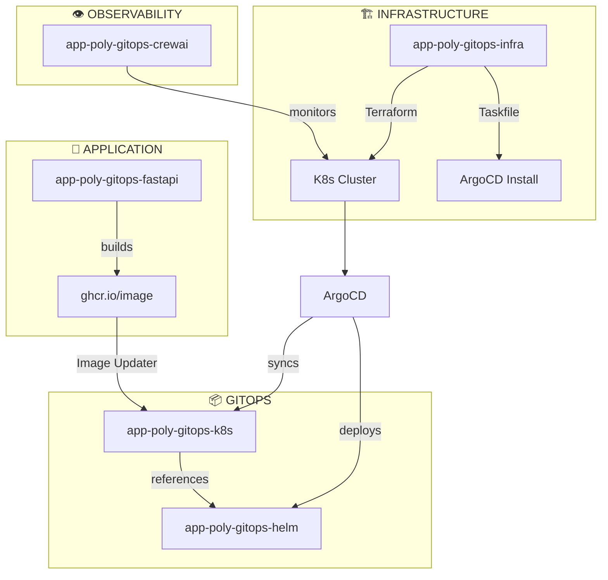
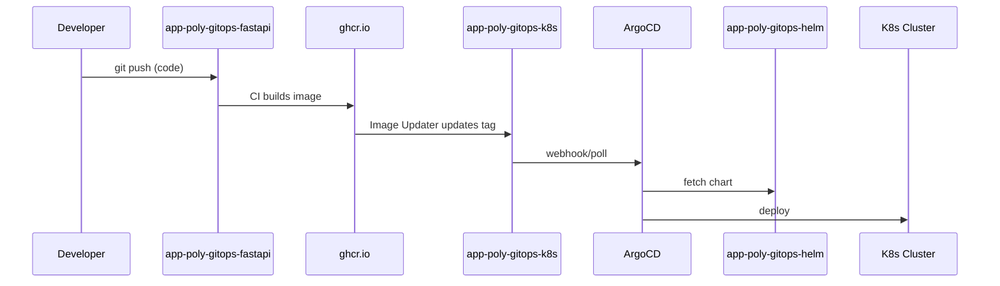
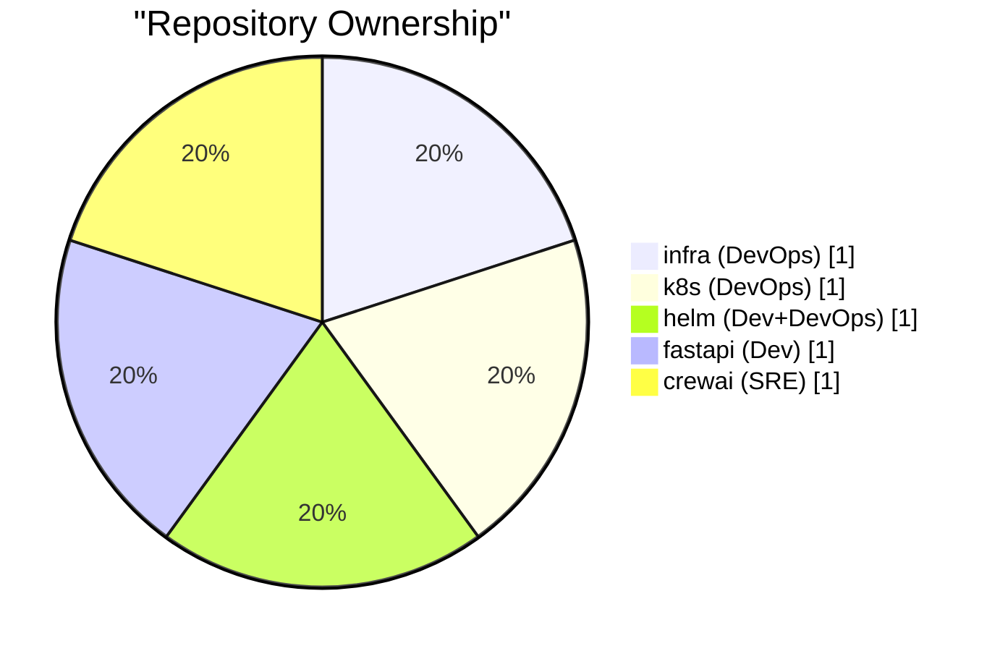
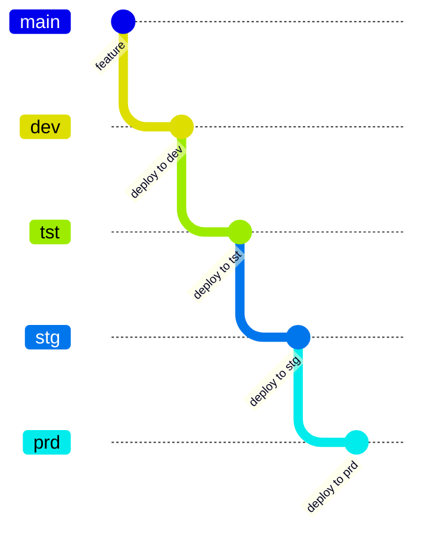
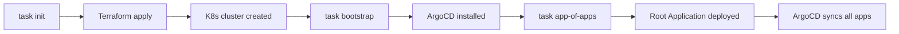
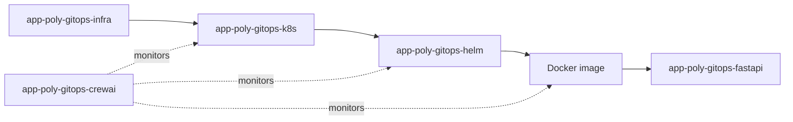

# Architecture Overview

## Repository Ecosystem



## Data Flow



## Repository Responsibilities



## Repository Matrix

| Repository | Layer | Owner | Changes When |
|------------|-------|-------|--------------|
| **app-poly-gitops-infra** | Infrastructure | DevOps | New cluster, infra changes |
| **app-poly-gitops-k8s** | GitOps | DevOps | New apps, environments, policies |
| **app-poly-gitops-helm** | Deployment | Dev + DevOps | App deployment structure |
| **app-poly-gitops-fastapi** | Application | Dev | Application code |
| **app-poly-gitops-crewai** | Observability | SRE | Monitoring rules |

## Environments Flow



## Bootstrap Sequence



## Deployment Chain

The complete dependency chain showing how repositories connect:



## Startup Sequence

| Step | Repository | Action |
|------|------------|--------|
| 1 | **infra** | `task up` → Terraform creates k8s → installs ArgoCD |
| 2 | **k8s** | ArgoCD syncs manifests → creates Applications |
| 3 | **helm** | ArgoCD renders Helm chart with values from k8s |
| 4 | **fastapi** | CI builds Docker → pushes to ghcr.io |
| 5 | **k8s** | Image Updater detects new tag → commits to k8s |
| 6 | **crewai** | Monitors that everything works |

## Dependency Tree

```
infra
└── creates cluster + ArgoCD
    └── k8s (ArgoCD Applications)
        └── helm (Helm charts)
            └── Docker image
                └── fastapi (code)

crewai → observes all of the above
```

## Related Links

- [app-poly-gitops-infra](https://github.com/justgithubaccount/app-poly-gitops-infra) - This repository
- [app-poly-gitops-k8s](https://github.com/justgithubaccount/app-poly-gitops-k8s) - GitOps manifests
- [app-poly-gitops-helm](https://github.com/justgithubaccount/app-poly-gitops-helm) - Helm charts
- [app-poly-gitops-fastapi](https://github.com/justgithubaccount/app-poly-gitops-fastapi) - FastAPI application
- [app-poly-gitops-crewai](https://github.com/justgithubaccount/app-poly-gitops-crewai) - CrewAI monitoring
